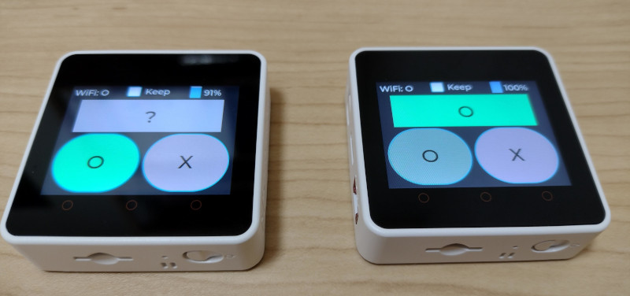

# quick-answer

This is a program for [M5Stack Core2](https://shop.m5stack.com/products/m5stack-core2-esp32-iot-development-kit) devices.
Using the devices with this program, you can quickly tell your partner if you are gonna answer the doorbell (or not).

The program is developed with [UIFlow](https://m5stack.com/uiflow) framework at https://flow.m5stack.com

## How it works

This program runs on a pair of devices.
You keep one of them, while your partner keeps the other.

Each device has two buttons ("O" and "X") on the lower side of the screen.

- Pressing "O" indicates that you are OK (e.g., you can answer the doorbell.)
- Pressing "X" indicates that you are not OK (e.g., you cannot answer the doorbell.)

When you press the button, your intension is shown in your partner's device (in the upper side of the screen.)

When you don't touch the button for a while, both buttons will go back to grey. Your partner's device will show "?", meaning that your intension is unknown.

Under the hood, the two devices communicate with each other over Wi-Fi and a MQTT broker.

## How to use

TODO

## Author

Toshio Ito <debug.ito@gmail.com>

